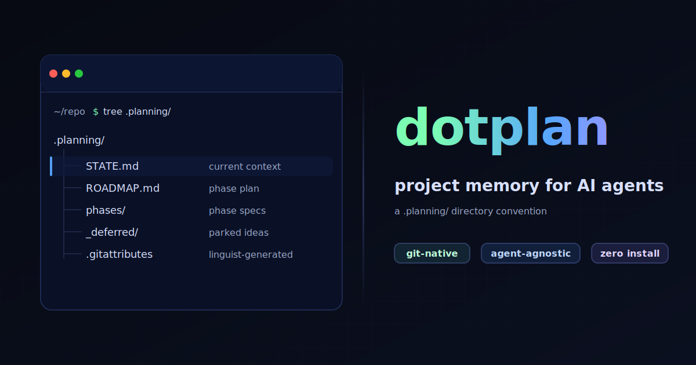

<p align="center">
  
</p>

# dotplan

An opinionated workflow for AI coding agents. Zero install, git-native, agent-agnostic.

dotplan is a `.planning/` directory convention and a methodology that any agent can follow — spec before code, separate implementation from review, compact state between sessions, treat documentation as part of the task. It's not a CLI tool or a framework. It's markdown files that travel with your repo.

## Why

You ask your agent to continue yesterday's refactor and it starts over from scratch — no memory of the 8 phases you already completed, the architectural decisions you made, or the bugs you already fixed. AI coding agents are stateless. Every new session starts from zero, and the human becomes the bottleneck for continuity.

dotplan solves this with two things:

1. **Structured project state** — markdown files in `.planning/` that any agent can read to pick up where the last session left off, whether that's the same agent, a different model, or a different tool entirely.

2. **A workflow convention** — opinions about *how* agents should work: assess complexity before starting, write specs before code, use different models for implementation vs. review, compact state so it doesn't grow unbounded, and treat documentation as a required part of every task.

You can use the state management without the workflow opinions, but they work best together.

## Quick Start

Create a `.planning/` directory in your project with these files:

```
.planning/
  ROADMAP.md          # ordered phases with status
  STATE.md            # active context (what's happening now)
  STATE-archive.md    # completed phase history
  phases/             # per-phase specs and summaries
  _deferred/          # parked ideas not on the roadmap yet
```

Then add to `.gitattributes` so GitHub collapses planning files in PR diffs and excludes them from language stats:

```
.planning/** linguist-generated
```

Then add dotplan instructions to your project's agent instruction file (`CLAUDE.md`, `AGENTS.md`, `.cursorrules`, etc.) — see [Agent Instructions](#agent-instructions).

Or use the init script to scaffold everything automatically:

```bash
curl -fsSL https://raw.githubusercontent.com/jamesondh/dotplan/main/init.sh | bash
```

## The Files

### Your agent instruction file (CLAUDE.md, AGENTS.md, etc.)

dotplan doesn't create a separate project description file. You already have one — your agent instruction file. Every major AI coding tool has its own version: `CLAUDE.md` for Claude Code, `AGENTS.md` for Codex/OpenCode, `GEMINI.md` for Gemini CLI, `.cursorrules` for Cursor, etc.

That file should already describe what you're building, the tech stack, constraints, and conventions. dotplan just asks you to add workflow instructions to it (see [Agent Instructions](#agent-instructions)). Static project context belongs there. `.planning/` is purely for dynamic state — where you are, where you're going, what happened.

### ROADMAP.md

The phase plan. Updated as phases complete or new ones are discovered.

```markdown
# Roadmap

## Completed
- [x] Phase 1: Project scaffold
- [x] Phase 2: Core pipeline

## In Progress
- [ ] **Phase 3: API integration**

## Planned
- [ ] Phase 4: Deployment & monitoring
- [ ] Phase 5: Multi-tenant support

## Deferred
- Phase N: Nice-to-have feature (see `_deferred/feature-name.md`)
```

### STATE.md

The most important file. This is the bridge between sessions — it tells the agent exactly where things stand right now.

**Keep it under 150 lines.** This is active context, not a history log. When a phase completes, move its content to STATE-archive.md.

What belongs in STATE.md:
- Current phase and task-level status
- Last completed phase (brief summary, 5-10 lines)
- Active decisions that affect upcoming work
- Blockers
- Key metrics (test count, build status, whatever matters)

What does NOT belong:
- Full history of completed phases (→ STATE-archive.md)
- Detailed verification results from past work (→ phase SUMMARY.md)
- Design rationale that doesn't affect current work (→ your agent instruction file)

### STATE-archive.md

Append-only log of completed phase summaries. The agent reads this on demand when it needs historical context, but it's not loaded every session. This is what keeps STATE.md lean.

### phases/

Each phase gets a numbered directory:

```
phases/
  01-scaffold/
    SPEC.md       # what to build, task breakdown
    SUMMARY.md    # what actually happened (written after completion)
  02-core-api/
    SPEC.md
    SUMMARY.md
```

#### SPEC.md

The implementation plan for a phase. Written before work begins.

```markdown
# Phase N: {Name}

## Goal
{What this phase accomplishes}

## Risk
{Low / Medium / High. Note migrations, auth changes, external APIs, infra.}

## Tasks

### Task 1: {Description}
**Files:** src/foo.ts (new), src/bar.ts (modify)
**Docs to update:** README.md (add section on foo)
**Steps:**
- Step-by-step implementation notes
**Verify:** `npm test`
**Done when:** {Concrete completion condition}

### Task 2: ...
```

The **"Docs to update"** field is intentional. Documentation should be part of the task, not an afterthought. If a task adds a feature, command, or config option, the spec says which docs to update. The implementing agent treats this as required, not optional.

#### SUMMARY.md

Written after a phase completes. Records what actually happened vs. what was planned.

```markdown
# Phase N: {Name} — Summary

## Context
{Why this phase, what triggered it}

## Key Changes
- What was implemented (focus on "what" and "why", not line-by-line)

## Verification
{What was tested and how}

## Issues Found
{Bugs, review findings, spec divergence. "None" if clean.}

## Decisions Made
{Architectural or design decisions that affect future work}

## Follow-ups
{Deferred items, next-phase implications, things to revisit. "None" if clean.}

## Metrics
{Test count, build status, performance numbers — whatever's relevant}
```

### _deferred/

Ideas that came up during development but aren't on the active roadmap. Each file is a lightweight sketch — enough to pick up later without losing context.

When you're ready to work on a deferred idea, move it to `phases/NN-{name}/SPEC.md` and flesh it out.

## The Workflow

dotplan isn't just file structure — it's an opinionated agent orchestration workflow. These opinions come from running multi-phase projects across hundreds of agent sessions and learning what breaks.

### Complexity Assessment

The first opinion: **not every task needs the full workflow.** Agents should assess complexity before starting and calibrate ceremony accordingly.

| Level | Signals | Approach |
|-------|---------|----------|
| **Simple** | 1-2 files, clear change, no risk | Just do it. No spec, no `.planning/` updates needed. |
| **Medium** | 3-5 files, single-phase, limited risk | Write a spec (`phases/NN-{name}/SPEC.md`), implement, review. Update STATE.md but skip the full wrap-up checklist — no SUMMARY.md or STATE-archive entry needed. |
| **Complex** | Multi-phase, 5+ files, architectural decisions, or high-risk changes (auth, migrations, external APIs, infra) | Full dotplan workflow: spec each phase, review the spec, implement, review the implementation, write SUMMARY.md, compact STATE.md → STATE-archive.md, full wrap-up checklist. |

Risk matters more than file count. A one-file auth change can be higher risk than a ten-file UI refactor. When in doubt, err toward more structure.

### The Loop

**Setup (once per project):**
1. Create `.planning/`, add dotplan instructions to your agent instruction file
2. Draft ROADMAP.md with proposed phases
3. Add `.gitattributes` entry

**Per phase:**
1. **Spec** — Write `phases/NN-{name}/SPEC.md` with task breakdown. Every task lists files to modify *and* docs to update.
2. **Implement** — Work through the tasks. Update STATE.md as you go.
3. **Review** — Review the changes with a different model or tool than what implemented. This is the most important opinion in dotplan: the agent that writes code should not be the only one that evaluates it.
4. **Wrap up** — Follow the phase wrap-up checklist. If you skip a step, note why in the SUMMARY.

### Phase Wrap-up Checklist

After every phase completion:

- [ ] Push all commits
- [ ] Write `phases/NN-{name}/SUMMARY.md`
- [ ] Compact STATE.md — move completed phase to STATE-archive.md
- [ ] Update ROADMAP.md — mark phase complete, confirm next
- [ ] Doc check — did all docs listed in task specs get updated?
- [ ] Commit `.planning/` changes
- [ ] Review upcoming phases — revise if this phase revealed new complexity

### Session Recovery

When an agent picks up a project cold:

1. Read the agent instruction file for stable project context (what, why, stack, conventions)
2. Read ROADMAP.md for the big picture
3. Read STATE.md for active context
4. That's usually enough. If more history is needed, read STATE-archive.md or specific phase SUMMARYs.

STATE.md is the bridge. Keep it current and lean.

### STATE.md Compaction

At phase wrap-up:

1. Move the completed phase block from STATE.md → append to STATE-archive.md
2. Keep only: current phase, last completed summary (brief), active decisions/blockers
3. If STATE.md exceeds ~150 lines, aggressively trim

This prevents the common failure mode where state files grow unbounded and crowd out useful context.

## Opinions

dotplan is opinionated. These are strong defaults, not suggestions. You can override any of them, but the system works best when you follow them — and if you skip one, note why in your SUMMARY.

### Spec before code

Every non-trivial phase starts with a written spec. This catches issues before implementation, gives reviewers something to check against, and creates a record of intent vs. outcome. Agents that jump straight to code produce more rework.

### Separate implementation and review

The agent (or model) that implements should not be the only one that reviews. This can mean:
- Using a different AI model for review
- Having an orchestrating agent review subagent output
- Human review

dotplan doesn't prescribe *which* models or tools to use — that's project-level preference. But it does prescribe that implementation and review are separate steps, ideally done by separate models.

### Model roles are harness config, not project state

dotplan prescribes *roles* — implementation, review, spec writing — but not which models fill them. That's deliberate. Model preferences depend on your setup, budget, and which models are good *this month*. They change faster than your workflow.

Where to configure model roles:
- **Agent harness global context** — if your orchestrator loads a system prompt or memory (e.g., `CLAUDE.md` at `~/.claude/`, Cursor settings, or a custom agent's long-term memory), define your default model assignments there. This is the most common approach.
- **Project agent instruction file** — if a specific project needs different model assignments (e.g., a Rust project where you want a model with stronger systems programming for implementation), override in that project's `CLAUDE.md`/`AGENTS.md`.
- `.planning/` is the wrong place. Model config is not project state.

The only strong opinion: implementation and review should be done by different models (or at least different sessions). Everything else — which model writes specs, which runs verification, whether you use subagents or inline — is yours to decide.

### Documentation is part of the task

The "Docs to update" field in task specs makes documentation structural, not aspirational. The implementing agent updates docs as part of the task because the spec told it to, not because it remembered to. Docs that aren't specified in the task don't get written.

### State has a size budget

STATE.md stays under 150 lines. Completed phases get compacted into STATE-archive.md. This isn't arbitrary — unbounded state files crowd out useful context in an agent's limited context window. The 800-line state file that worked great on Phase 3 becomes a liability by Phase 15.

### Static content first, dynamic content last

Arrange context from most stable to most volatile: agent instruction file (rarely changes) → ROADMAP.md (changes slowly) → STATE.md (changes every phase). AI agents benefit from stable prefixes in their context — content that doesn't change between sessions can be cached more efficiently.

### Deferred work has a home

Ideas that come up mid-phase but aren't urgent go in `_deferred/`. This prevents scope creep while ensuring good ideas aren't lost. It's the difference between "we'll get to it" (forgotten) and "it's in `_deferred/auth-refactor.md`" (preserved).

## Agent Instructions

dotplan only works if your agent knows about it. Add the dotplan workflow instructions to whatever agent instruction file your project uses:

| Tool | Primary file | Notes |
|------|-------------|-------|
| Claude Code | `CLAUDE.md` | Also searches `.claude/CLAUDE.md`, `.claude/rules/*.md` |
| Codex CLI (OpenAI) | `AGENTS.md` | Also checks `AGENTS.override.md`; walks git root → cwd |
| OpenCode | `AGENTS.md` | Falls back to `CLAUDE.md` if no `AGENTS.md` found |
| Gemini CLI | `GEMINI.md` | Configurable via `settings.json` to also read `AGENTS.md` |
| Cursor | `.cursor/rules/*.mdc` | `.cursorrules` still works but is deprecated |
| Windsurf | `.windsurf/rules/*.md` | `.windsurfrules` still works but is legacy |
| GitHub Copilot | `.github/copilot-instructions.md` | `AGENTS.md` support opt-in via settings |
| Cline | `.clinerules` | Auto-detects `.cursorrules`, `.windsurfrules`, `AGENTS.md` too |
| Aider | None (manual) | Use `--read CONVENTIONS.md` or configure in `.aider.conf.yml` |

If you need a single file that works across the most tools with zero configuration, `AGENTS.md` at repo root has the broadest native support (Codex, OpenCode, plus opt-in for Copilot, Cline, and Gemini). For Claude Code specifically, you still need `CLAUDE.md`.

A ready-to-use snippet is in [`templates/AGENT-INSTRUCTIONS.md`](templates/AGENT-INSTRUCTIONS.md). Copy it into your project's file alongside your existing project description, stack info, and conventions.

Or add the short version:

```
This project uses the dotplan workflow for structured development.
Before starting work, read `.planning/STATE.md` and `.planning/ROADMAP.md`
to understand current project state. For non-trivial changes, write a spec
before implementing, review with a different model than what implemented,
and follow the phase wrap-up checklist (SUMMARY, compact STATE, update
ROADMAP, doc check). Keep STATE.md under 150 lines.
```

## FAQ

**Should I commit `.planning/` to git?**
Yes. It's the project's development history and makes it possible to pick up from any machine. Use `.gitattributes` with `linguist-generated` to keep it out of PR diffs and language stats.

**What if I'm working solo?**
dotplan works great solo. The value isn't collaboration overhead — it's session continuity. Your agent tomorrow won't remember what your agent today decided.

**What if I'm using multiple agents?**
That's where dotplan really shines. Different agents (or different models) can read the same `.planning/` state and maintain continuity without sharing conversation history.

**How does `.planning/` work with branches?**
See [Working with Branches](#working-with-branches) below.

**Does this replace GitHub Issues / Linear / Jira?**
No. dotplan is for the agent's working context, not project management for humans. Use it alongside your normal issue tracker. Think of it as the agent's notebook, not the team's kanban board.

**What if a phase goes off-plan?**
That's what SUMMARY.md is for. Record what actually happened vs. what was planned. Future phases can reference this to understand why things diverged.

**How is this different from just good commit messages?**
Commit messages record what changed. dotplan records *where you are, where you're going, and why.* It's the difference between a changelog and a map.

## Real-World Example

Here's what `.planning/` looks like on a real project after 14 phases — an invoice processing pipeline built with AI agents over several weeks.

### CLAUDE.md (project context + dotplan instructions in one file)

```markdown
# Invoice Pipeline

Automated invoice processing for small businesses. Extracts line items from
PDF/image invoices (OCR + LLM), matches against purchase orders, flags
discrepancies, and pushes approved invoices to QuickBooks.

## Stack
- Backend: Python 3.12, FastAPI, SQLAlchemy, Celery
- Frontend: Next.js, TypeScript, Drizzle ORM, Postgres
- OCR: Tesseract + GPT-4o fallback for low-confidence pages
- Storage: S3-compatible (MinIO local, R2 prod)

## Project Management
This project uses dotplan for structured development.
Before starting work, read `.planning/STATE.md` and `.planning/ROADMAP.md`.
Keep STATE.md under 150 lines. Compact at phase wrap-up.
```

The project description and dotplan instructions live together — no separate file to maintain.

### ROADMAP.md (after 14 phases — a living document)

```markdown
# Roadmap

## Completed
- [x] Phase 1: Project scaffold + CI
- [x] Phase 2: PDF extraction pipeline
- [x] Phase 4: LLM line-item parsing
- [x] Phase 5: PO matching engine
- [x] Phase 6: Web UI (mocked data)
- [x] Phase 7: Postgres + real data layer
- [x] Phase 8: S3 document storage
- [x] Phase 10: QuickBooks OAuth + sync
- [x] Phase 11: Discrepancy detection
- [x] Phase 12: Email ingestion
- [x] Phase 14: Bulk import + progress tracking

## In Progress
- [ ] **Phase 9: Multi-tenant isolation** — auth done, row-level security remaining

## Planned
- [ ] Phase 13: Approval workflows
- [ ] Webhook notifications
- [ ] Audit log + SOC 2 evidence collection
- [ ] Deploy to production (Fly.io + managed Postgres)

## Deferred
- ML confidence scoring — train on correction history (see `_deferred/ml-scoring.md`)
- Mobile upload app — originally Phase 3, descoped (see `_deferred/mobile-app.md`)
```

Notice the non-sequential numbering — Phase 3 was descoped, phases were added and reordered as the project evolved. That's normal. The roadmap reflects reality, not the original plan.

### STATE.md (compact — well under the 150-line budget)

```markdown
# Project State

## Last Completed Phase

**Phase 14: Bulk Import + Progress Tracking — COMPLETE ✅**
CSV/ZIP upload endpoint with Celery background processing. Progress
bar via SSE. Handles 500+ invoices per batch. Rate limiting on LLM calls.

## Active Work

**Phase 9: Multi-tenant isolation — partially complete**
Auth middleware + tenant context done. Remaining: row-level security
policies on all tables, tenant-scoped S3 prefixes, test isolation.

## Blockers
- QuickBooks sandbox rate limits slowing integration tests
- Need SOC 2 auditor feedback on tenant isolation approach

## What's Built
- Full pipeline: PDF upload → OCR → LLM extraction → PO matching → QB sync
- 12 supported invoice formats (auto-detected)
- 340 Python tests, 47 frontend tests
- Processing ~200 invoices/day in staging
```

The full history of all completed phases lives in STATE-archive.md, not here. STATE.md is just what the agent needs to know *right now*.

### phases/ directory (specs and summaries accumulate over time)

```
phases/
  01-scaffold/
    SPEC.md
    SUMMARY.md
  02-pdf-extraction/
    SPEC.md
    SUMMARY.md
  ...
  09-multi-tenant/
    SPEC.md        # (no SUMMARY yet — still in progress)
  ...
  14-bulk-import/
    SPEC.md
    SUMMARY.md
```

Each SUMMARY.md records what actually happened — issues found during review, decisions made, how the implementation diverged from the spec. This is the project's institutional memory.

## Principles

dotplan is built on a few beliefs about how agentic software development works — and doesn't.

### Convention over tooling

The biggest adoption barrier for any workflow is installation. dotplan has none. No CLI to install, no MCP server to configure, no API keys to set up, no package to keep updated. It's markdown files in a directory. Any agent that can read files can follow dotplan. This is a deliberate trade-off: you lose automation features (like dependency-aware task execution) but gain universality and zero maintenance burden.

### The human is the orchestrator (for now)

AI agents are good at implementing well-scoped tasks. They're not yet reliable at deciding what to build next, recognizing when a plan needs to change, or knowing when "done" actually means done. dotplan puts the human in the orchestration seat — you write specs, review output, decide when to defer or pivot, and manage the roadmap. The agent handles execution within those boundaries.

It's all but certain that autonomous agents will win out over human-steered agents. Human orchestration is a pragmatic choice given current model capabilities, not a philosophical one. The orchestration role will shift from active steering to review and approval — and eventually to exception handling.

dotplan is designed to survive that transition. STATE.md is readable by humans and agents alike. The conventions (spec before code, separate review, compact state) don't assume a human is driving — they work whether you're steering an agent in a chat UI, reviewing PRs that an autonomous agent shipped, or building a pipeline where agents orchestrate other agents. The workflow stays the same; only who's running it changes.

### Context is the bottleneck, not intelligence

Most agent failures aren't because the model is dumb. They're because the model doesn't know what you already decided, what was tried and failed, or what the current state of the project is. dotplan treats context management as the primary problem — bounded state files, explicit session recovery, static-first ordering for cache efficiency. The model is smart enough if you give it the right context.

### Plans are wrong, planning is useful

No spec survives implementation intact. That's fine. The value of writing a spec isn't prediction — it's forcing yourself to think through the tasks, identify which files change, and name what "done" looks like before writing code. SUMMARY.md exists specifically to record how reality diverged from the plan.

### Review is not optional

Implementation and review should be done by different models or at least different sessions. This isn't about distrust — it's about perspective. The model that wrote the code has already committed to its approach. A fresh model reading the same code will catch things the implementer is blind to. This is the single highest-ROI practice in the entire workflow.

## Comparisons

dotplan exists alongside several other tools tackling the same problem space. They make different trade-offs.

### [Beads](https://github.com/steveyegge/beads) (Steve Yegge)

A distributed, git-backed graph issue tracker for AI agents. Beads gives you a proper database layer (Dolt) with hash-based IDs, dependency tracking, hierarchical tasks, and graph relationships between issues. It's closer to "what if we rebuilt Jira for agents" — structured, queryable, powerful.

**Where Beads shines:** Multi-agent coordination, dependency-aware task routing, semantic compaction of closed issues, proper merge conflict handling across branches.

**Where dotplan differs:** dotplan is deliberately simpler — no binary to install, no database, no query language. You trade Beads' structured querying for files you can read and edit in any text editor. If you need agents to autonomously pick their next task from a dependency graph, Beads is the better fit. If you need a human-orchestrated workflow that any agent can follow with zero setup, that's dotplan.

### [GSD (Get Shit Done)](https://github.com/gsd-build/get-shit-done)

A meta-prompting and context engineering system for Claude Code, OpenCode, and Gemini CLI. GSD is the most fully-featured option — it has slash commands for every stage (research, discuss, plan, execute, verify), spawns parallel subagents, does wave-based dependency execution, and manages context window capacity.

GSD was a direct inspiration for dotplan. The `.planning/` directory structure, `STATE.md`, `ROADMAP.md`, and the spec-before-code workflow all evolved from ideas first explored in GSD.

**Where GSD shines:** Automated orchestration — it handles the research → plan → execute → verify loop for you with specialized subagents. Wave-based parallel execution. Context window management to prevent quality degradation.

**Where dotplan differs:** GSD is a tool; dotplan is a convention. GSD requires installation (`npx get-shit-done-cc`), runs as Claude Code slash commands, and is tightly coupled to specific agent runtimes. dotplan works with any agent, any editor, any model — including setups that don't exist yet. GSD also makes more decisions for you (it spawns the agents, chooses the prompts, manages the context). dotplan leaves orchestration to you. If you want a turnkey system and you're using Claude Code, GSD is excellent. If you want a portable methodology, that's dotplan.

### [Taskmaster](https://github.com/eyaltoledano/claude-task-master)

A task management system that parses PRDs into structured tasks with dependencies, subtasks, and complexity ratings. Started as an MCP server for Cursor/Windsurf but now supports Claude Code, Codex CLI, and other tools.

**Where Taskmaster shines:** PRD → task breakdown is genuinely useful for greenfield projects. MCP integration means the agent can query tasks conversationally. Supports many AI providers and editor integrations.

**Where dotplan differs:** Taskmaster is focused on task management — breaking down requirements and tracking what's done. dotplan is focused on session continuity and workflow — making sure the agent knows where things stand and follows a consistent process. Taskmaster doesn't have opinions about spec-before-code, implementation vs. review separation, or state compaction. You could use Taskmaster for task tracking and dotplan for workflow — they're not mutually exclusive.

### [Entire](https://entire.io/) (Thomas Dohmke, ex-GitHub CEO)

A git observability layer for AI agents. Entire captures the reasoning behind agent-generated code — prompts, transcripts, tool calls, files touched — and versions it alongside your commits on a separate branch (`entire/checkpoints/v1`). It's a CLI (`entire enable` in your repo) that hooks into Claude Code or Gemini CLI and runs in the background, creating "checkpoints" you can rewind to or resume from.

The core thesis is "version-controlled reasoning": git tracks *what* changed but not *why*. As agents write more code than humans can review, the reasoning trace becomes more important than the diff. Entire captures that trace automatically.

**Where Entire shines:** Traceability and audit — you get a full transcript of every agent session linked to its commit. Rewind/resume across sessions without reconstructing prompts. Onboarding (show the path from prompt → change → commit). Compliance use cases where you need to prove *why* code was written a certain way.

**Where dotplan differs:** Different layers of the same problem. Entire answers "how did this code get written?" — it's backward-looking, capturing reasoning after the fact. dotplan answers "where are we and what's next?" — it's forward-looking, giving agents the context to continue work across sessions. Entire doesn't have opinions about workflow (spec before code, separate review, state compaction). dotplan doesn't capture reasoning traces or agent transcripts. They're complementary: Entire for the audit trail of *how*, dotplan for the working state of *what's happening now*.

One key difference in philosophy: Entire requires a CLI install and hooks into specific agent runtimes (Claude Code, Gemini CLI). dotplan is just markdown files. Entire captures context automatically; dotplan requires agents to maintain state deliberately. The trade-off is automation vs. portability — Entire gives you richer data with less effort, dotplan works with any agent that can read files.

### The trade-off spectrum

```
More automation                                               More portability
←────────────────────────────────────────────────────────────────────────────→
  GSD            Taskmaster       Entire       Beads         dotplan
  (slash cmds,   (MCP server,     (CLI +       (CLI + DB,    (just markdown,
  subagents)     editor plugin)   git hooks)   git-backed)   zero install)
```

dotplan is the most portable and least automated. That's intentional — the bet is that the orchestration layer (which agent, which model, how to run it) changes faster than the workflow conventions (spec before code, compact state, review separately). By not encoding orchestration into the tool, dotplan avoids becoming coupled to any specific agent runtime.

Entire occupies an interesting middle ground — it's a CLI with hooks, but it's lightweight and doesn't try to orchestrate your workflow. It augments git rather than replacing it. If you want both reasoning traces *and* structured workflow, using Entire + dotplan together makes sense.

## Working with Branches

dotplan's default workflow assumes a single developer working on a single branch — the most common setup for solo devs and side projects. But `.planning/` works naturally with branches because it's just files in git.

### Branch-scoped state

When you create a feature branch, you get your own copy of every `.planning/` file. No special configuration needed. STATE.md on your branch reflects your branch's work. ROADMAP.md on main stays the canonical plan.

This means parallel branches can have divergent STATE.md files, each tracking their own phase progress. That's fine — STATE.md is meant to be branch-scoped context, not a global lock.

### Merging `.planning/`

When a feature branch merges back to main:

| File | Merge strategy |
|------|---------------|
| **STATE.md** | Take the merging branch's version, then reconcile with main's current state. STATE.md is cheap to rewrite — the real history lives in summaries and archive. |
| **STATE-archive.md** | Append-only, so conflicts are just ordering. Concatenate both sides. |
| **ROADMAP.md** | Take main's version, then update with whatever the branch completed. |
| **phases/** | Specs and summaries have unique names — they rarely conflict. |

After merge, compact STATE.md on main: update it to reflect post-merge reality, archive what's done.

### Multiple agents, multiple branches

If you have multiple agents working in parallel (e.g., via git worktrees), each agent's branch has its own STATE.md. There's no shared mutable state to coordinate — git handles the isolation, and merge-time is when you reconcile.

dotplan doesn't try to solve conflict detection between parallel agents (no tool has, reliably). Instead, it ensures that when branches do merge, the `.planning/` files are straightforward to reconcile because state is compact and history is append-only.

### What dotplan doesn't do

dotplan doesn't manage issue tracking, task delegation, or agent coordination. It's the agent's working notebook, not a project management layer. Use your existing issue tracker (GitHub Issues, Linear, Jira) for task assignment. Use dotplan for the agent's session-to-session context within whatever task it's been assigned.

## Adopting Mid-Project

You don't need to start a project with dotplan. To retrofit an existing codebase:

1. Run `init.sh` (or create `.planning/` manually)
2. Add the dotplan workflow instructions to your existing agent instruction file (`CLAUDE.md`, `AGENTS.md`, `.cursorrules`, etc.)
3. In ROADMAP.md, list what's already been done as completed phases (brief, no need for full specs) and what's next
4. Write STATE.md with the current situation — what you're working on, what's blocked, recent decisions
5. Start the dotplan workflow from the *next* piece of work

You don't need to retroactively create specs or summaries for past work. The value is forward-looking — giving your agent context about where things stand and a process for what comes next.

## What's Next

dotplan is a README, an init script, and templates. The core will stay simple — convention over tooling. But there are a few things on the horizon:

- **Example repos** — real projects with `.planning/` at various stages (early, mid-project, 15+ phases), so people can see what the workflow looks like in practice rather than just reading about it.
- **Project type conventions** — community-contributed patterns for different workflows: solo/main-branch, multi-branch with PRs, autonomous agent pipelines. The core spec stays the same; the conventions show how to apply it in different contexts.

If you have a project using dotplan and want to share how it's working (or not), open an issue. The best improvements to the workflow have come from running into real problems on real projects.

## License

MIT
