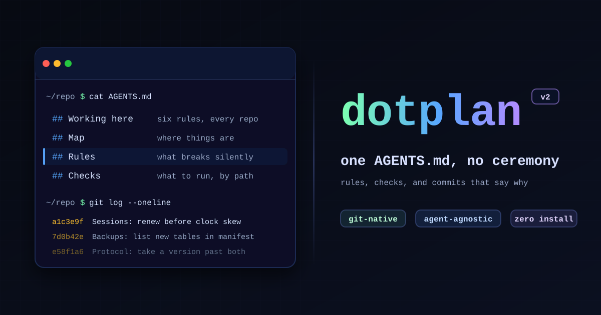

<p align="center">
  
</p>

# dotplan

dotplan is a short `AGENTS.md` template and a small set of habits for repos where coding agents work. It has three
parts:

1. **`AGENTS.md`**: a map of the repo, the rules that are easy to break, and the checks that find the breaks.
2. **Commit messages** that record why each change was made.
3. **Design docs** in `docs/<topic>/`, only for steps that are hard to reverse or long.

There is nothing to install and no planning directory to maintain.

This is what works for me as of October 2026, mostly with Opus 5.5. It will change, as v1 did. Test it on your own
repos ([how](#test-it-on-your-own-repos)), and keep what makes your agents better.

## Why so little

dotplan v1 (early 2026) had three goals:

- Let an agent continue from where the last session stopped.
- Make past decisions and designs easy to audit.
- Improve the process with a postmortem after each phase of work.

It used a `.planning/` directory with a roadmap, a state file, and a spec for each phase. v2 keeps the goals and
removes the directory:

- **Continuity:** current agents rebuild the state of a project from git and the code in seconds.
- **Audit:** each commit message gives the reason for its change. Large designs go in `docs/<topic>/`.
- **Improvement:** when something breaks and nobody sees it, the lesson becomes a rule in `AGENTS.md`, which agents
  read every session. In v1, lessons stayed in postmortems and state files, and agents found them less often. This
  is narrower than a postmortem. To improve the process itself, I run evals ([below](#test-it-on-your-own-repos)).

The v1 files also became longer with time and needed regular cleanup. With Opus 5.5, they made my work slower, not
faster. v1 is on the [`v1` branch](https://github.com/jamesondh/dotplan/tree/v1).

## What I measured

I tested v2 on three of my own repos: a data platform, a trading service and a game, in TypeScript, C and Python.
Each had one to five months of work and 200 to 1,300 commits. For each repo, I wrote realistic requests and a key of
the traps that a careful engineer would mention. New agents planned each request without writing code, and blind
graders scored the plans against the keys.

These results are for Opus 5.5 in Claude Code, in bypass-permissions mode. The numbers are means per answer:

| Instruction file | Answers | Traps found | Tool calls | Input tokens |
|---|---|---|---|---|
| None | 24 | 72% | 8.2 | 347k |
| v2 `AGENTS.md` | 36 | 85% | 6.4 | 288k |

With the file, agents found 13 percentage points more traps, and they used 22% fewer tool calls and 17% fewer
tokens. On traps that the file describes, recall rose from 59% to 86%. With the same file, Codex (gpt-6-sol) found
68%. I did not test Codex without a file.

An earlier test, with Opus 5.5 subagents, compared v1 and v2 on the same three repos. **v2 found as many traps as
v1** (83% each, on average), with no state files to keep current. This was true only when the migration kept every
rule. Where the migration moved rules from old files into `AGENTS.md`, recall rose from 74% to 84%. Where it removed
rules to make the file shorter, recall fell from 88% to 81%.

The limits: three repos, one author, and keys that I wrote. The tests measure one thing: whether an agent finds the
known traps when it plans a change. They do not measure whether the code is correct, or whether the agent builds
more than the change needs, and they do not show that this template is better than another one.

## 1. `AGENTS.md`: map, rules, checks

Put one file at the repo root. The agent reads all of it at the start of each session. Most agent tools read
`AGENTS.md` directly. Claude Code 2.1.277 and later reads it when there is no `CLAUDE.md`. For earlier versions and
SDK harnesses, add a `CLAUDE.md` that contains only `@AGENTS.md`.

The file has four sections ([template](templates/AGENTS.md)):

- **Working here:** seven rules for how to work. They are the same in every repo.
- **Map:** where the important code is, one line for each item, 20 to 40 lines in total. Include each
  `docs/<topic>/` folder. Explanation goes in the README.
- **Rules:** things that a change can break without a visible error. Give each rule its reason and a check. The most
  useful rules involve more than one file. Example: "Each new table needs a line in the backup manifest, or backups
  do not include it." No single file tells you that.
- **Checks:** a table of the minimum checks to run for each path. Agents run the checks that the file lists. They
  often miss checks that are only in old commits.

A check is one of three types: a command, `manual: <what a person examines>`, or `none` if no script can find the
problem. If a check already fails at HEAD, write the commit that broke it. If a check can touch production (for
example, a test suite that reads `DATABASE_URL`), write how to run it safely.

**Length.** Keep the fixed sections short. The rules can use the space they need, at one or two lines each, under
subheadings. A few hundred lines of rules is acceptable. History and status do not go in this file. Codex reads a
maximum of 32 KiB of instruction files by default (`project_doc_max_bytes`), which is approximately 400 lines.

**Add rules from failures.** When something breaks and nobody sees it, add a rule. Add a check if you can write one.
A script is better than a paragraph, because an agent cannot misread a script.

### Nested `AGENTS.md` files

As of October 2026, I keep all rules in the root file, for two reasons:

- **Few rules belong to one directory.** In my three repos, only 7 of 79 rules applied to one directory.
- **Tools load nested files only in some conditions.** Claude Code loads a nested file when the agent opens a file
  in that directory with its Read tool. In bypass-permissions mode, the agent reads files with `cat`, so Claude Code
  did not load a nested file in any of 72 runs. On one repo, recall of the moved rules fell from 98% to 76% in
  bypass mode. In default mode, it did not fall (93% to 95%).

If your setup loads nested files reliably, they can work. Test it in your own setup. If the root file becomes too
long, move reference material out first.

## 2. Commits: the reason for each change

Agents already read the history. In my tests, new agents ran `git log -- <path>` and `git log -S`, and opened the last
commit that did the same task. Nobody told them to do this. Thus the history is the memory of the project, and the
commit messages set its quality.

- **The subject is the index.** Name what changed, and the trap if there was one. Use the words that a later search
  will use. Example: one commit fixed a conflict between two branches that both increased the protocol version.
  Its subject named only the two features, and no agent that searched for the problem found it. "Protocol version:
  two branches both bumped to 7; take a number past both on merge" is easy to find.
- **Commit small.** Make one change in each commit, and make each commit pass its checks. A small commit can name
  its trap exactly, and it is easy to find, revert and bisect.
- **The body gives the reason.** Write what was wrong, what you did, and what you rejected and why. Then write what
  you ran (with numbers) and what you did not test. If the diff makes the reason clear, you can omit the body.
- **Keep the reproduction of each fixed bug** as a test, a script or a fixture. In the body, write how to run it.

Example:

```
Sessions: renew the token before the clock-skew window, not at expiry (random logouts)

Servers whose clocks ran up to 40 s fast rejected tokens the client still thought
valid, so a user mid-request was logged out about once a day. Tokens now renew
when 90% of their life is gone. Ruled out: widening the server's skew tolerance,
which would also widen the window for a stolen token.

Ran: the auth suite (212 pass) and scripts/skew.sh, which runs a client against
servers 0-60 s fast: 0 rejections in 1,000 (was 37). Not tested: renewals during
a deploy, while both signing keys are live.
```

Trailers are not necessary, because agents read prose well.

## 3. `docs/<topic>/`: only for hard changes

Write a design doc only when a step:

- is hard to reverse (a schema, a protocol, auth, money), or
- continues for more than one session.

Judge each step, not the project. Copying history into a new repo is reversible, even when the project moves
money. For all other changes, the commits are the record.

Name the folder by topic, and keep it current while the work continues. A design doc has four parts:

- **Today:** how it works now, with file references, and a measured baseline if the work changes a number.
- **Design:** the target, and the rules that each step must obey.
- **Passes:** the steps, each with how you will know it worked. Use the project's checks or existing tools before
  you write new ones.
- **Status:** a table at the top of the folder's index. This is the only status that dotplan keeps, and it is for
  one topic.

Get a review of hard-to-reverse work from a new session that did not write it. A different model family can help
if it is at least as capable as the author. In [one controlled study](https://arxiv.org/abs/2607.21656), review
between two frontier models helped in one direction and made the result worse in the other. Ask the reviewer what
to cut, and whether the approach fits the request, not only what is missing. The author can decline a finding when
its fix costs more than the risk.

**Why this matters.** Each of these rules adds work, and an agent that follows them literally can stack them. In one
repo migration, a project that touched money made every step "hard to reverse". Each design doc needed measured
targets, so the agent wrote tooling to measure them. The tooling then needed its own docs and reviews, and every
review finding was fixed by adding more. The result was about 13,000 lines for what was mostly a history import.
So the template now starts with "do what was asked, the simplest way that meets it". Side work is a proposal that
says what it costs and what decision it would change. And the agent stops and tells the user when the work grows
well past what it expected.

## The loop

1. **Orient:** read the README and `AGENTS.md`, then run `git status` and `git log -n 20`. Look further back
   (`git log -- <paths>`, `-S`, `blame`) when the change repeats, reverses or depends on earlier work.
2. **Size the work:** most work goes directly to code. If a step is hard to reverse or long, start or update
   `docs/<topic>/`. If the work grows well past what you expected, stop and tell the user.
3. **Work, then run the checks** for each path you changed.
4. **Integrate:** after a merge, rebase or conflict resolution, run the checks again.
5. **Commit** with a subject that a search can find and a body that gives the reason.
6. **Promote:** if something broke and nobody saw it, add a rule and its check to `AGENTS.md` in the same commit as
   the fix.

## Test it on your own repos

What works for my repos and models may not work for yours. A small test tells you most of what you need:

1. Freeze a snapshot of the repo.
2. Write five or six requests of the type you really make.
3. For each request, write a key: the traps that a careful engineer who knows the project would mention, and where
   each trap is written (instruction file, README, docs, code or history).
4. Give each request to a new agent. Ask it what it would look out for and what it would run, but not to write code.
5. Grade the answers against the key. Compare instruction files on the same snapshot, including no file at all.

Look at recall for each layer, not only the total. Recall of traps in the instruction file should be almost 100%,
so the useful numbers are for the README, the code and the history. To measure what the commit messages carry,
remove the commit bodies from the snapshot. The decrease in recall is what the bodies carried.

## No opinion on

Merge, rebase or squash. Branches or direct commits to main. Issue trackers. Commit trailers. Which models.
One caveat: if you squash-merge, the squashed commit is the only history that remains. Its message must give the
reasons for the full branch.

## Setup

```bash
curl -fsSL https://raw.githubusercontent.com/jamesondh/dotplan/main/init.sh | bash
```

The script creates `AGENTS.md` from the [template](templates/AGENTS.md) if it does not exist, and a `CLAUDE.md`
that imports it. Then write the map, the rules you know, and the checks you run. You can also copy the template
manually. The script does nothing more.

## From v1

Cut history and status, but do not cut rules ([why](#what-i-measured)). Move each rule from `STATE.md`, the phase
specs and the old instruction file into `AGENTS.md`, and verify it against the code. Move in-progress design work
into `docs/<topic>/`. Keep finished phase specs in `.planning/phases/` as a frozen archive, because code comments
often refer to them. Then delete `STATE.md`, `ROADMAP.md`, `_deferred/` and `.planning/templates/`.
[SKILL.md](SKILL.md#migrating-from-v1-planning) has all the steps.

## Related work

- [Lore](https://arxiv.org/abs/2603.15566) (2026) turns commit messages into decision records with git trailers
  (`Constraint`, `Rejected`, `Directive`, `Not-tested`...) and a query CLI. dotplan agrees that commits are the
  correct place for this, but asks for prose, not a schema.
- [Entire](https://entire.io) keeps the transcript of each agent session with its commits.
  [git-ai](https://github.com/git-ai-project/git-ai) and Cursor's [Agent Trace](https://github.com/cursor/agent-trace)
  connect code to the conversations that wrote it. These tools keep everything. dotplan keeps what the next agent
  needs.

## Principles

- **Checks over prose.** An agent cannot misread a rule that it can run.
- **Derive state; do not cache it.** A file that repeats what git or the code says goes out of date, and agents
  trust it anyway. Keep intent (what is next, what is on hold) wherever you like.
- **The code and the running system are the truth.** Instruction files and docs are claims. When they disagree with
  the code, fix them in the same commit.
- **Put knowledge where agents look for it:** rules that are always true in `AGENTS.md`, the reason for a change in
  its commit, and the design of a hard subsystem in `docs/`.
- **Match the process to the reversibility.** Most changes need a good commit and nothing more. Every rule is a
  minimum or a trigger, not a reason to build more.
- **Measure, then change.** Remove ceremony that does not make your agents better, and add what does.
